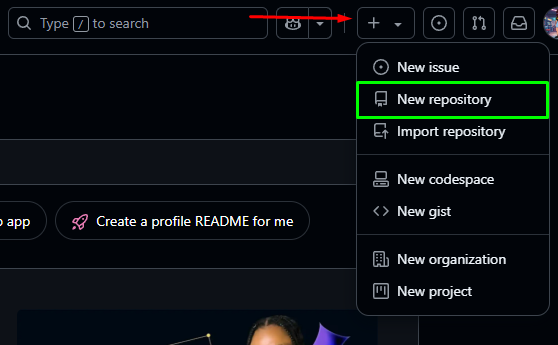
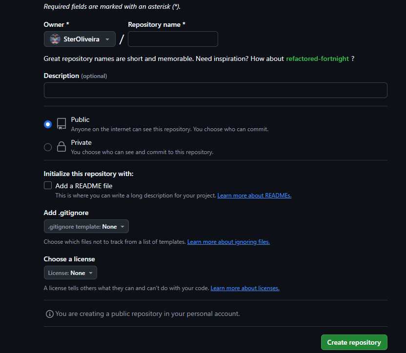

# 📘 Guia GitHub  
Um guia prático para auxiliar na utilização das principais ferramentas do GitHub.

---

## 📁 Criação de Repositórios

Um **repositório** funciona como uma "pasta de projeto", onde você pode armazenar:
- Códigos-fonte  
- Documentações  
- Arquivos diversos  
- Histórico de alterações (versionamento)  
- E também colaborar com outras pessoas

Ele é essencial para controlar as versões do seu projeto utilizando o **Git**.

---

## 🛠️ Como criar um repositório no GitHub

Você pode criar repositórios de duas formas:
- Pelo site oficial do **GitHub**
- Pelo aplicativo **GitHub Desktop**

---

### 🌐 Criação pelo Site

1. Acesse sua conta em [github.com](https://github.com)
2. Na **página principal** (Dashboard), clique no canto superior direito no menu em formato de “+”  
3. Selecione a opção **"New repository"**  

📸 *Exemplo visual:*  

---

### 📄 Formulário de criação do repositório

Após clicar em "New repository", a página de configuração será aberta:

📸 *Exemplo visual:* 
](<Captura de tela 2025-07-28 121617.png>)

Preencha os seguintes campos:

---

#### 🧩 1. **Repository name**  
Digite o nome do seu projeto. Esse será o identificador principal do repositório.  
> Exemplo: `meu-site-pessoal`, `api-vendas`, `projeto-social`

---

#### 🌍 2. **Visibilidade: Public ou Private**

Você deverá escolher se o seu repositório será **Público** ou **Privado**. Abaixo, explicações detalhadas sobre cada opção:

---

### 🔓 Public (Público)  
O repositório ficará **visível para qualquer pessoa** na internet.

Outros usuários poderão:
- Visualizar seu código
- Clonar (copiar) o projeto
- Sugerir melhorias com *pull requests* ou *issues*
- Usar como base para outros projetos

✅ **Quando usar:**
- Projetos de código aberto
- Portfólios públicos
- Tutoriais e exemplos para a comunidade

⚠️ **Atenção:** Nunca envie senhas, tokens de acesso ou informações sensíveis, pois **tudo será público**.

---

### 🔒 Private (Privado)  
O repositório será **acessado somente por você** e por pessoas que você convidar manualmente.

✅ **Quando usar:**
- Projetos em desenvolvimento
- Projetos pessoais ou profissionais confidenciais
- Anotações ou estudos particulares

📌 **Limite (conta gratuita):** Você pode adicionar até **3 colaboradores** por repositório privado.

💡 **Dica:** Se estiver em dúvida, crie o repositório como **privado**. Depois, é possível mudar para público a qualquer momento, acessando as **configurações (Settings)** do repositório.
