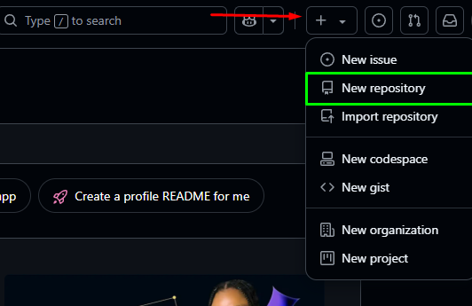

# 📘 Guia GitHub  
Um guia prático para auxiliar na utilização das principais ferramentas do GitHub.

---

## 📁 Criação de Repositórios

Um **repositório** funciona como uma "pasta de projeto", onde você pode armazenar:
- Códigos-fonte  
- Documentações  
- Arquivos diversos  
- Histórico de alterações (versionamento)  
- E também colaborar com outras pessoas

Ele é essencial para controlar as versões do seu projeto utilizando o **Git**.

---

## 🛠️ Como criar um repositório no GitHub

Você pode criar repositórios de duas formas:
- Pelo site oficial do **GitHub**
- Pelo aplicativo **GitHub Desktop**

---

## 🌐 Criação pelo Site

1. Acesse sua conta em [github.com](https://github.com)
2. Na **página principal** (Dashboard), clique no canto superior direito no menu em formato de “+”  
3. Selecione a opção **"New repository"**  

📸 *Exemplo visual:*  

---

### 📄 Formulário de criação do repositório

Após clicar em "New repository", a página de configuração será aberta:

📸 *Exemplo visual:* 

Preencha os seguintes campos:

---

#### 🧩 1. **Repository name**  
Digite o nome do seu projeto. Esse será o identificador principal do repositório.  
> Exemplo: `meu-site-pessoal`, `api-vendas`, `projeto-social`

---

#### 🌍 2. **Visibilidade: Public ou Private**

Você deverá escolher se o seu repositório será **Público** ou **Privado**. Abaixo, explicações detalhadas sobre cada opção:

---

### 🔓 Public (Público)  
O repositório ficará **visível para qualquer pessoa** na internet.

Outros usuários poderão:
- Visualizar seu código
- Clonar (copiar) o projeto
- Sugerir melhorias com *pull requests* ou *issues*
- Usar como base para outros projetos

✅ **Quando usar:**
- Projetos de código aberto
- Portfólios públicos
- Tutoriais e exemplos para a comunidade

⚠️ **Atenção:** Nunca envie senhas, tokens de acesso ou informações sensíveis, pois **tudo será público**.

---

### 🔒 Private (Privado)  
O repositório será **acessado somente por você** e por pessoas que você convidar manualmente.

✅ **Quando usar:**
- Projetos em desenvolvimento
- Projetos pessoais ou profissionais confidenciais
- Anotações ou estudos particulares

📌 **Limite (conta gratuita):** Você pode adicionar até **3 colaboradores** por repositório privado.

💡 **Dica:** Se estiver em dúvida, crie o repositório como **privado**. Depois, é possível mudar para público a qualquer momento, acessando as **configurações (Settings)** do repositório.

---

### 📘 Para que serve o README.md?

**README:** Em inglês, significa "leia-me". É um nome tradicional usado para indicar que aquele arquivo contém informações importantes.

**.md:** É a extensão de Markdown, uma linguagem de marcação simples usada para formatar textos com títulos, listas, links, imagens etc.

É o cartão de visita do seu projeto. Ele aparece automaticamente na página inicial do repositório no GitHub.

**Geralmente, o arquivo contém:**

- ✅ Nome e descrição do projeto

- 🔧 Tecnologias utilizadas

- 🚀 Como instalar e usar

- 💡 Funcionalidades

- 🧑‍💻 Créditos ou autores

- 📄 Licença

- 📷 Imagens, gifs ou vídeos demonstrando o projeto

---

### 🧩 O que faz a opção “Add .gitignore”

O arquivo `.gitignore` é um recurso fundamental em projetos que utilizam Git. Ele serve para **informar ao Git quais arquivos ou pastas não devem ser monitorados, versionados ou enviados ao repositório remoto (como o GitHub)**.

---

## 📌 Por que usar o `.gitignore`?

Durante o desenvolvimento de um projeto, muitos arquivos são criados automaticamente pelo sistema, pelas ferramentas de desenvolvimento ou por bibliotecas/frameworks. Esses arquivos:

- Não são úteis para o funcionamento do projeto de outras pessoas
- Podem conter **informações sensíveis** (como senhas ou chaves de API)
- Aumentam o tamanho do repositório desnecessariamente
- Podem gerar conflitos entre sistemas operacionais

---

## 📂 Exemplos comuns de arquivos que devem ser ignorados

| Tipo de Arquivo            | Exemplo                        | Motivo para Ignorar                                   |
|---------------------------|--------------------------------|--------------------------------------------------------|
| Pastas de dependências    | `node_modules/`                | Recriada com `npm install`, ocupa muito espaço        |
| Arquivos de log           | `*.log`                        | Apenas úteis localmente para debug                    |
| Arquivos de ambiente      | `.env`                         | Podem conter senhas, tokens e dados confidenciais     |
| Cache do Python           | `__pycache__/`, `*.pyc`        | Arquivos compilados que não precisam ser versionados |
| Configurações do VS Code  | `.vscode/`                     | Preferível manter apenas configurações compartilháveis|
| Arquivos do sistema       | `.DS_Store`, `Thumbs.db`       | Gerados automaticamente por macOS ou Windows          |

---

## 🧠 Como o GitHub usa o `.gitignore`

Ao criar um repositório novo no GitHub, você verá a opção:

> **Add .gitignore**

Se você escolher essa opção, o GitHub permite selecionar **uma linguagem ou framework específico**, como `Python`, `Node`, `Java`, entre outros.

Isso ajuda a gerar um `.gitignore` **pronto com as regras mais recomendadas** para aquele tipo de projeto. Assim, você evita esquecer de ignorar arquivos indesejados.

---

## 📄 Principais Licenças do GitHub

Ao criar um repositório no GitHub, você pode escolher uma **licença de uso** para seu projeto. Essa licença define **o que outras pessoas podem ou não fazer** com o seu código.

---

### 🔓 MIT License (Licença mais popular)
- ✅ Permite **usar, copiar, modificar e distribuir** seu código.
- ⚠️ O usuário deve manter os **créditos do autor original**.
- ❌ Não oferece garantias legais.
- 📌 Ideal para quem quer **compartilhar livremente**, inclusive **para fins comerciais**.

---

### 📘 Apache License 2.0
- ✅ Permite **uso, modificação e distribuição**, inclusive com **proteção de patente**.
- 🛡️ Protege legalmente o autor.
- ⚠️ Exige manter o aviso de licença e as **notificações de patente**.
- 📌 Boa para projetos **corporativos e profissionais**.

---

### 👥 GNU GPL v3 (General Public License)
- ✅ Permite uso e modificação.
- ⚠️ **Obrigatório que versões modificadas também sejam públicas (open source)**.
- ❌ Não pode ser usada em softwares proprietários/fechados.
- 📌 Boa para quem deseja que o projeto **continue livre para sempre**.

---

### 🆓 Unlicense
- ✅ Libera o código totalmente no **domínio público**.
- ❌ Não exige atribuição ou oferece garantias.
- 📌 Ideal para quem **não quer manter nenhum direito reservado**.

---

### 🚫 Nenhuma Licença (sem escolha)
- ❌ Por padrão, **nenhum direito é concedido** a outros usuários.
- Outros **não podem legalmente usar, copiar ou modificar** seu código.
- 📌 Use se quiser manter o projeto **fechado ou sob total controle**.

---

### ⚖️ Tabela Comparativa Rápida

| Objetivo                            | Licença Indicada     |
|------------------------------------|-----------------------|
| Compartilhar livremente            | `MIT`                |
| Código aberto com proteção legal   | `Apache 2.0`         |
| Garantir que o código sempre seja livre | `GPL v3`        |
| Liberação total, sem restrições    | `Unlicense`          |
| Manter controle (sem permissão)    | *(Nenhuma)*          |

---

##  Criação pelo APP